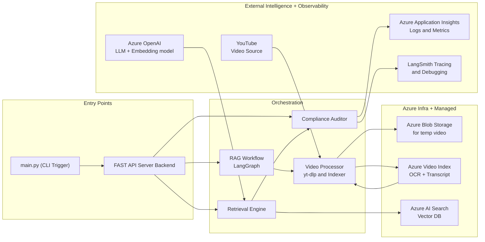

# Azure Multi-Modal Compliance QA Pipeline

## Project Overview

This project is an **automated video compliance auditing system** that validates YouTube video advertisements against regulatory guidelines (FTC disclosures, YouTube ad specs). It combines **Azure AI services**, **RAG (Retrieval-Augmented Generation)**, and a **LangGraph-based agentic workflow** to generate structured compliance reports.

The system accepts a YouTube URL, processes both spoken content (transcript) and on-screen text (OCR), retrieves relevant legal rules from a vector database, and uses GPT-4o to determine compliance — returning a **Pass/Fail** verdict with detailed violation categories and severity levels.

---

## System Architecture


The architecture follows a modular, cloud-native design with clear separation of concerns:

- **Entry Points**: FastAPI backend server (REST) and CLI (main.py)
- **Orchestration Layer**: LangGraph stateful workflow managing the audit pipeline
- **Video Processing**: Azure Video Indexer for transcript + OCR extraction
- **Storage**: Azure Blob Storage (temporary video) + Azure AI Search (vector DB for compliance rules)
- **Reasoning Engine**: Azure OpenAI GPT-4o with embedding model (text-embedding-ada-002)
- **Observability**: LangSmith (LLM tracing) + Azure Application Insights (telemetry, logs, metrics)


---

## Key Features

- **Multimodal Ingestion**: Extracts both spoken dialogue (transcript) and visual text (OCR) from video ads
- **RAG Implementation**: Retrieves only relevant compliance rules from a vectorized knowledge base (FTC + YouTube policy PDFs), avoiding full-document LLM context
- **Stateful Agentic Workflow**: LangGraph nodes (`indexer` → `auditor`) maintain shared state across the pipeline
- **Production-Ready API**: FastAPI endpoints with request/response models (Pydantic) and automatic interactive docs (`/docs`)
- **Full Observability**: LangSmith traces LLM reasoning steps; Azure App Insights provides performance monitoring, live metrics, and failure analysis
- **Deterministic Outputs**: LLM forced to return structured JSON with severity, category, and description for each violation

---

## Technical Stack

| Component | Technology |
|-----------|------------|
| Orchestration | LangGraph (stateful graph) |
| API Framework | FastAPI + Uvicorn |
| LLM + Embeddings | Azure OpenAI (GPT-4o, text-embedding-ada-002) |
| Video Intelligence | Azure Video Indexer (Transcript + OCR) |
| Vector Database | Azure AI Search (Hybrid search: keyword + vector) |
| Storage | Azure Blob Storage (temporary video) |
| LLM Tracing | LangSmith |
| Monitoring | Azure Application Insights (OpenTelemetry) |
| Video Download | yt-dlp |
| Python Environment | UV (package manager) |

---

## How It Works (Step-by-Step)

1. **User submits** a YouTube ad URL via `POST /audit`
2. **FastAPI** triggers the LangGraph workflow
3. **Video download** (yt-dlp) → upload to Azure Blob Storage
4. **Azure Video Indexer** processes the video, extracting:
   - Full transcript (spoken words)
   - OCR text (brand claims, disclaimers, on-screen text)
5. **Retrieval** → Vector similarity search over Azure AI Search fetches relevant compliance rules (FTC, YouTube ad specs)
6. **Reasoning** → GPT-4o compares video content against rules, returning structured JSON:
   - `status`: "pass" / "fail"
   - `compliance_results`: list of violations (category, severity, description)
   - `final_report`: summary
7. **Response** → Audit report returned via API
8. **Observability** → LangSmith traces each LLM call; App Insights logs latency, errors, and dependencies

---

## Project Structure

```
compliance-qa-pipeline/
├── backend/
│   ├── data/                   # FTC + YouTube policy PDFs
│   ├── scripts/
│   │   └── index_documents.py  # Chunk + vectorize PDFs to Azure AI Search
│   ├── src/
│   │   ├── api/
│   │   │   ├── server.py       # FastAPI endpoints
│   │   │   └── telemetry.py    # Azure App Insights setup
│   │   ├── graph/
│   │   │   ├── state.py        # LangGraph state schema
│   │   │   ├── nodes.py        # Indexer + Auditor logic
│   │   │   └── workflow.py     # Graph construction & compilation
│   │   └── services/
│   │       └── video_indexer.py # Azure Video Indexer wrapper
│   └── tests/
├── .env                         # All Azure credentials & API keys
├── main.py                      # CLI orchestration entry point
└── pyproject.toml               # Dependencies (UV)
```

---

## Key Design Decisions (for AI Architect Evaluation)

| Decision | Rationale |
|----------|-----------|
| **LangGraph over LangChain** | Stateful graphs allow shared context across nodes; better for multi-step agentic workflows |
| **Azure AI Search (vector + keyword)** | Legal documents require both semantic (embedding) and exact-match (keyword) retrieval |
| **Separate indexer & auditor nodes** | Decouples video processing from LLM reasoning; improves debuggability & reusability |
| **Forced JSON output from LLM** | Ensures deterministic, machine-parseable responses for downstream systems |
| **Dual observability (LangSmith + App Insights)** | LangSmith traces LLM thought chains; App Insights monitors infrastructure & API performance |
| **Temporary local download then upload** | Azure Video Indexer cannot directly consume YouTube URLs; requires local download + blob upload |

---

## Example Compliance Report (Output)

After auditing a Neutrogena ad featuring John Cena, the system returned:

```json
{
  "status": "fail",
  "compliance_results": [
    {
      "severity": "critical",
      "category": "claim_validation",
      "description": "Sunscreen 'you can't see' implies invisibility — scientific claim without evidence."
    },
    {
      "severity": "critical",
      "category": "endorsement_disclosure",
      "description": "No clear disclosure that John Cena is a paid endorser (missing 'ad', 'sponsored')."
    }
  ],
  "final_report": "Violates FTC rules: unsubstantiated claim + missing endorsement disclosure."
}
```

---

## Observability & Monitoring

- **LangSmith Dashboard**: Trace each execution — input transcript, retrieved rules, LLM prompt, output JSON, token usage, latency
- **Azure Application Insights**: Live metrics, dependency mapping (calls to YouTube, Video Indexer, AI Search), failure analysis, request logs


---

## Getting Started (High-Level)

1. Provision Azure resources:
   - Storage Account (Blob)
   - Azure AI Search (vector index)
   - Azure Video Indexer
   - Azure OpenAI (GPT-4o + text-embedding-ada-002)
   - Application Insights
2. Configure `.env` with all connection strings, keys, and endpoints
3. Run `uv sync` to install dependencies
4. Index PDFs: `python backend/scripts/index_documents.py`
5. Start FastAPI: `uv run uvicorn backend.src.api.server:app --reload`
6. Test via `POST /audit` with YouTube URL

---
